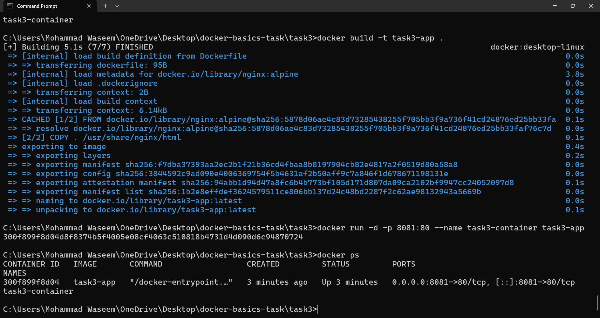
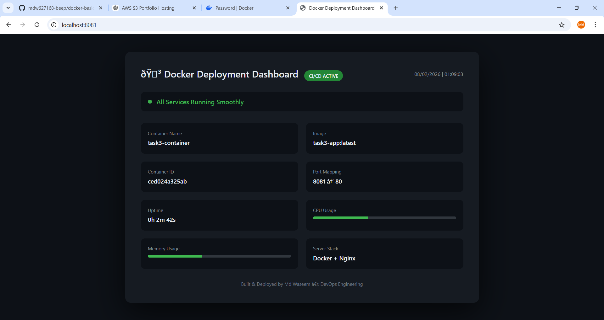

# 🚀 Docker Basics – Task 3

## 📌 Objective
Containerize a static web application using Docker and deploy it locally.

## 🛠 Technologies Used
- Docker
- Nginx
- HTML/CSS
- GitHub

## ⚙️ Steps Performed
1. Created Dockerfile
2. Built Docker image
3. Created container
4. Port mapping (8081 → 80)
5. Verified deployment in browser

## ▶️ Commands Used
docker build -t task3-app .
docker run -d -p 8081:80 --name task3-container task3-app

## 🌐 Output
App accessible at:
http://localhost:8081

## 📸 Screenshots

## 📸 Output Screenshots

### Docker Build

### Running Container

### Final Dashboard

